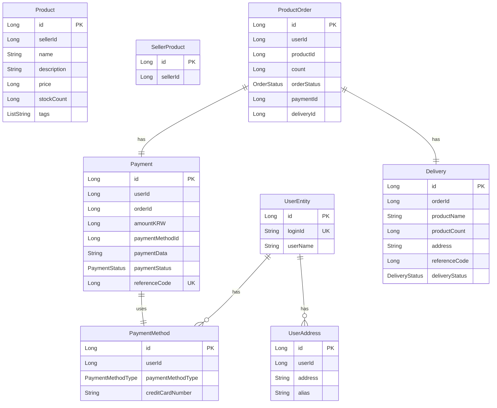

# order-app

```mermaid
erDiagram
    %% Member Service
    UserEntity {
        Long id PK
        String loginId UK
        String userName
    }

    %% Catalog Service
    Product {
        Long id PK
        Long sellerId
        String name
        String description
        Long price
        Long stockCount
        ListString tags
    }

    SellerProduct {
        Long id PK
        Long sellerId
    }

    %% Order Service
    ProductOrder {
        Long id PK
        Long userId
        Long productId
        Long count
        OrderStatus orderStatus
        Long paymentId
        Long deliveryId
    }

    %% Payment Service
    PaymentMethod {
        Long id PK
        Long userId
        PaymentMethodType paymentMethodType
        String creditCardNumber
    }

    Payment {
        Long id PK
        Long userId
        Long orderId
        Long amountKRW
        Long paymentMethodId
        String paymentData
        PaymentStatus paymentStatus
        Long referenceCode UK
    }

    %% Delivery Service
    UserAddress {
        Long id PK
        Long userId
        String address
        String alias
    }

    Delivery {
        Long id PK
        Long orderId
        String productName
        Long productCount
        String address
        Long referenceCode
        DeliveryStatus deliveryStatus
    }

    %% 연관관계
    UserEntity ||--o{ PaymentMethod : "has"
    UserEntity ||--o{ UserAddress : "has"
    
    ProductOrder ||--|| Payment : "has"
    ProductOrder ||--|| Delivery : "has"
    
    Payment ||--|| PaymentMethod : "uses"
```